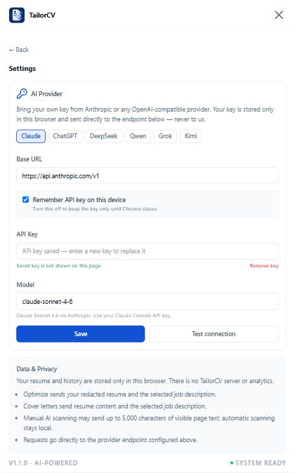
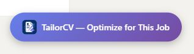
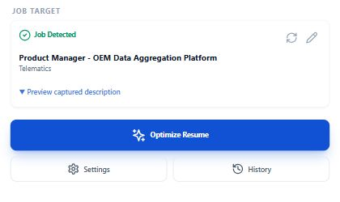

<div align="center">
  
  <h1>TailorCV</h1>
  <p><strong>Tailor your resume to any job posting with your own AI provider key.</strong></p>
  <p>Open source · No account · No backend · No subscription</p>

  <p>
    <a href="GETTING_STARTED.md">Quick Start</a> ·
    <a href="#supported-providers">Providers</a> ·
    <a href="PRIVACY.md">Privacy</a> ·
    <a href="CONTRIBUTING.md">Contributing</a> ·
    <a href="CHANGELOG.md">Changelog</a>
  </p>

  <p>
    <a href="https://github.com/muzzamil-data/job-resume-optimizer/actions/workflows/ci.yml"></a>
    <a href="https://github.com/muzzamil-data/job-resume-optimizer/releases/latest"></a>
    <a href="LICENSE"></a>
    
  </p>
</div>

<p align="center">
  
</p>

TailorCV is a local-first Chrome extension that detects a job description, optimizes your resume for it, calculates an ATS score, drafts a cover letter, and exports the result as PDF or DOCX. AI requests go directly from the extension to the endpoint you configure.

## Why TailorCV?

| Capability | What you get |
|---|---|
| Job-aware optimization | Scan supported job boards or paste any job description manually. |
| Local ATS analysis | Keyword coverage, title match, experience relevance, achievements, and education checks. |
| Bring your own key | Use Claude, ChatGPT, DeepSeek, Qwen, Grok, Kimi, or a compatible custom endpoint. |
| Local-first privacy | Resumes and history stay in browser storage; there is no TailorCV server or telemetry. |
| Practical exports | Download optimized resumes and cover letters as PDF or DOCX. |
| Open source | Inspect the prompts, storage, provider calls, and document generation yourself. |

## Quick start

1. Download and extract the ZIP from [the latest release](https://github.com/muzzamil-data/job-resume-optimizer/releases/latest), or build the project locally.
2. Open `chrome://extensions`, enable **Developer mode**, and select **Load unpacked**.
3. Choose the extracted extension folder or the generated `dist/` folder.
4. Open a supported job page and select the TailorCV launcher.
5. Configure your provider, upload your resume, and select **Optimize Resume**.

See [GETTING_STARTED.md](GETTING_STARTED.md) for the complete illustrated walkthrough.

<p align="center">
  
  &nbsp;&nbsp;
  
</p>

## Features

- One-click resume optimization for LinkedIn, Indeed, Glassdoor, Greenhouse, Lever, Workday, and other supported boards.
- Reliable manual scanning and **Paste JD** fallback when a page cannot be recognized.
- Local ATS scoring with gaps and quick-win recommendations.
- Cover-letter generation in four tones.
- PDF and DOCX resume and cover-letter exports.
- First-run guidance for provider configuration and resume upload.
- Session-only API key storage when **Remember API key on this device** is disabled.
- Validated local backup and restore; exported backups never contain API keys.

## Supported providers

| Provider | Base URL | Example model |
|---|---|---|
| Claude | `https://api.anthropic.com/v1` | `claude-sonnet-4-6` |
| ChatGPT | `https://api.openai.com/v1` | `gpt-4o` |
| DeepSeek | `https://api.deepseek.com` | `deepseek-v4-flash` |
| Qwen | `https://dashscope-intl.aliyuncs.com/compatible-mode/v1` | `qwen3.7-plus` |
| Grok | `https://api.x.ai/v1` | `grok-4.5` |
| Kimi | `https://api.moonshot.ai/v1` | `kimi-k2.5` |

Qwen keys and endpoints are region-specific. If the preset does not match your account, use the OpenAI-compatible endpoint shown in your Alibaba Cloud Model Studio workspace. Custom endpoints implementing `POST /chat/completions` are also supported.

## Privacy by design

- Automatic job scanning uses local DOM selectors and does not call an AI provider.
- Before resume optimization, TailorCV redacts your name, email, and phone number locally and restores them afterward.
- Manual AI scanning may send up to 5,000 characters of visible page text only when you request it.
- TailorCV has no backend, account system, analytics, or telemetry.
- Your API key can be remembered locally or kept only for the current Chrome session.

Read [PRIVACY.md](PRIVACY.md) for the exact data sent by each action.

## Development

Requirements: Node.js 20.16+; Node.js 22 or 24 LTS is also supported.

```bash
npm install
npm run typecheck
npm run build
npm run test:e2e
```

Use `npm run dev` for watch builds into `dist/`. Reload the unpacked extension at `chrome://extensions` after rebuilding.

### Architecture

- **Manifest V3 + React + TypeScript** — the sidebar runs inside an isolated Shadow DOM.
- **Content script** — detects supported pages and coordinates scanning in [`src/content`](src/content).
- **Service worker** — builds prompts, parses documents locally, and contacts only the configured provider endpoint.
- **Local libraries** — ATS scoring, resume parsing, job-board adapters, storage, and document generation live in [`src/lib`](src/lib).

## Community

- Read the [contribution guide](CONTRIBUTING.md).
- Review the [security policy](SECURITY.md) before reporting a vulnerability.
- Check [release notes](CHANGELOG.md) for recent changes.
- Open a [GitHub issue](https://github.com/muzzamil-data/job-resume-optimizer/issues) for reproducible bugs or feature ideas.

## License

TailorCV is available under the [MIT License](LICENSE).
