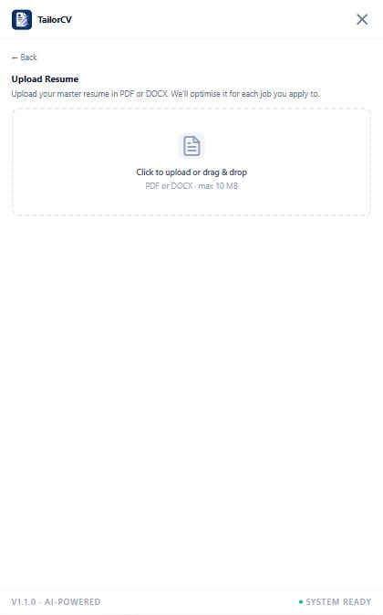
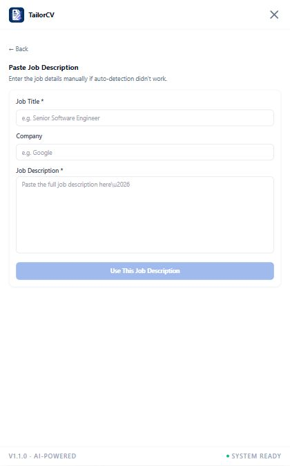

# Getting Started with TailorCV

This guide shows the complete first-use workflow. TailorCV stores your résumé and history in Chrome extension storage and sends AI requests only to the provider endpoint you configure.

## 1. Install the extension

1. Download and extract `tailorcv-v1.1.0.zip` from [GitHub Releases](https://github.com/muzzamil-data/job-resume-optimizer/releases/tag/v1.1.0), or run `npm install` and `npm run build` from the source repository.
2. Open `chrome://extensions`.
3. Enable **Developer mode**.
4. Select **Load unpacked**.
5. Choose the extracted extension folder or the generated `dist/` folder.
6. Pin TailorCV from Chrome's Extensions menu.

## 2. Open TailorCV on a job page

Visit a supported job page. Select the TailorCV launcher near the lower-right corner to open the sidebar.

## 3. Configure your AI provider

Open **Settings**, choose Claude, ChatGPT, DeepSeek, Qwen, Grok, or Kimi, and enter the corresponding API key and model.

Use **Test connection** before saving. Clear **Remember API key on this device** if you want the key kept only until Chrome closes. TailorCV never displays a saved key on the Settings page.

## 4. Upload your résumé

Select **Upload Resume** or **Update**, then choose a PDF or DOCX file up to 10 MB. TailorCV parses and stores the résumé locally in the browser.

## 5. Select a job description

TailorCV automatically scans supported job pages using local page selectors. When a job is detected, review the title and company before optimizing.

If detection does not find the posting, select **Scan Page** to run a manual scan. You can always use **Paste JD** and enter the job title, company, and full description yourself.

## 6. Optimize and export

1. Select **Optimize Resume**.
2. Review the optimized content, ATS score, gaps, and suggested improvements.
3. Generate a cover letter if needed.
4. Export the result as PDF or DOCX.
5. Use **History** to revisit saved application records.

## Privacy reminder

- Automatic job scanning stays local and does not call an AI provider.
- Optimization sends a locally redacted résumé and the selected job description to your configured provider.
- Manual AI scan fallback may send up to 5,000 characters of visible page text.
- JSON backups exclude API keys.

See [PRIVACY.md](../PRIVACY.md) for the complete data-handling explanation.
